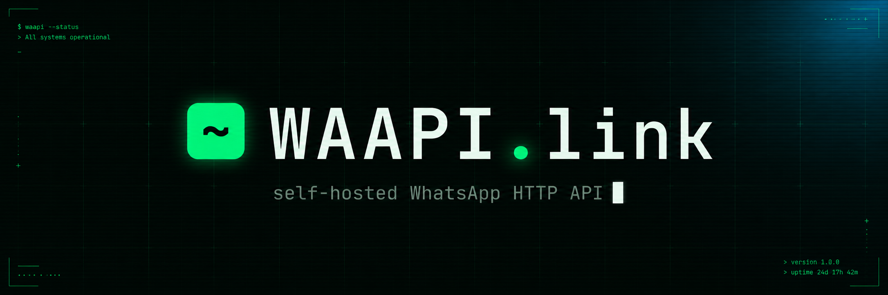

<p align="center">
  
</p>

<p align="center">
  <a href="https://github.com/mecaca-global-inc/waapi-gateway/actions/workflows/ci.yml"></a>
  <a href="LICENSE"></a>
  <a href="https://go.dev/"></a>
  <a href="https://nodejs.org/"></a>
</p>

# WAAPI Gateway

Self-hosted **WhatsApp HTTP API + Dashboard** — single Go binary, Next.js control panel, Docker-ready.

> ## ⚠️ Disclaimer — read before use
>
> WAAPI Gateway is an **unofficial, independent, open-source project**. It is
> **not** affiliated with, endorsed by, or sponsored by WhatsApp LLC or Meta
> Platforms, Inc. "WhatsApp" is a trademark of its respective owner, used here
> only to identify the service this software interoperates with.
>
> Using an **unofficial client may violate the WhatsApp Terms of Service** and
> can result in your phone number being **banned**. You — the operator — are
> solely responsible for compliance with the WhatsApp ToS, anti-spam and
> data-protection laws, and obtaining consent from message recipients.
>
> The software is provided **"AS IS", with no warranty and no liability** (see
> [LICENSE](LICENSE)). **You use it entirely at your own risk.**
>
> Full terms: **[DISCLAIMER.md](DISCLAIMER.md)** · For a supported, compliant
> integration use the [WhatsApp Business Platform](https://business.whatsapp.com/).

## Features

- 🔌 **Multi-session** — run many WhatsApp accounts per gateway instance
- 📱 **QR + pairing-code login**
- 💬 **Send** text, image, video, voice (PTT), file, location, contact
- 👀 **Receipts & presence** — mark-as-read, typing indicators
- ⏳ **Disappearing-messages aware** — auto-inherits the chat's ephemeral timer so replies don't trigger the "sender may be on an old version" warning
- 👥 **Group admin** — create, add/remove/promote/demote, rename, topic, lock, announce-only, photo, invite link, join-by-link, disappearing timer
- 📥 **Webhook delivery** with HMAC-SHA256 signing, retries, event filtering
- 🔴 **Live WebSocket stream** for the dashboard
- 🎨 **Next.js 16 dashboard** — sessions, send playground, webhooks, API keys, embedded Swagger UI
- 🗄️ **SQLite default**, Postgres via `DB_URI`
- 🐳 **Docker / Docker Compose** ready
- 🤖 **MCP server built in** — `waapi-gateway mcp` exposes 45+ tools to Claude Desktop, Cursor, OpenCode, Codex, n8n (see [docs/DEPLOY-MCP.md](docs/DEPLOY-MCP.md))

## Quick start

### Easiest — prebuilt image (no clone, no build)

```bash
docker run -d --name waapi \
  -p 3000:3000 \
  -e ADMIN_PASS=ChangeMeToSomethingStrong!23 \
  -v waapi_data:/app/storages \
  ghcr.io/mecaca-global-inc/waapi-gateway:latest
```

Open <http://localhost:3000>. Login `admin` / your `ADMIN_PASS`. Dashboard, REST API, OpenAPI docs all live on the same URL.

Multi-arch image (linux/amd64 + linux/arm64) auto-published from the `main` branch.

### Docker Compose (clone the repo)

```bash
git clone https://github.com/mecaca-global-inc/waapi-gateway
cd waapi-gateway
cp .env.example .env
# Edit ADMIN_PASS in .env — gateway refuses to boot with weak defaults
docker compose up -d --build
```

Same URL: <http://localhost:3000>.

## Deploy guides

Step-by-step instructions for specific platforms:

- [Zeabur](docs/DEPLOY-ZEABUR.md) — single-binary, recommended for individuals + small teams
- [MCP server](docs/DEPLOY-MCP.md) — connect Claude Desktop / Cursor / OpenCode / n8n via Model Context Protocol

## Deploy to a container PaaS (Railway / Render / Fly / xCloud / Coolify)

The gateway needs a long-running process and a persistent disk — **Vercel is not a good fit**. Use Vercel for the dashboard / landing only.

Two compose files ship in this repo:

| File | Use when |
|---|---|
| `docker-compose.yml`       | local dev (gateway **and** dashboard, two ports) |
| `docker-compose.cloud.yml` | cloud deploy (gateway only, one port, env-var driven) |

For one-click "Deploy from Git" flows:

1. Point the platform at this repository, branch `main`.
2. Set the compose file to **`docker-compose.cloud.yml`**.
3. Primary service port: **`3000`** (gateway).
4. Required environment variables:
   - `ADMIN_USER` (default `admin`)
   - `ADMIN_PASS` — must be strong (gateway refuses to boot on weak defaults)
   - optional: `CORS_ORIGINS`, `LOG_FORMAT=json`, `DEVICE_NAME=YourBrand`
5. Make sure the platform mounts the `gateway_data` volume on `/app/storages` so device sessions survive restarts.
6. Deploy. Verify: `GET /healthz` returns `{"ok":true}`.
7. Host the dashboard separately on **Vercel** with `NEXT_PUBLIC_GATEWAY_URL=https://<your-public-gateway>`.

## Local development

```bash
go version    # 1.26+
node -v       # 22+

cp .env.example .env
# set a strong ADMIN_PASS

# terminal 1
go run ./cmd/server

# terminal 2
cd dashboard
npm install
npm run dev -- -p 3001
```

## Authentication

Two layers:

| Layer | Audience | Method |
|---|---|---|
| `POST /api/login` | Dashboard / first-time CLI users | Username + password (`ADMIN_USER`/`ADMIN_PASS`) → returns an API key |
| `Authorization: Bearer <key>` *or* `X-Api-Key: <key>` | All `/api/*` calls | API key (managed in dashboard *Settings*) |

WebSocket `/ws` accepts the key via query param: `/ws?key=<api_key>`.

## REST API

Full interactive reference: **`/docs` in the dashboard** (loads from `/openapi.yaml`).

Highlights:

| Category | Endpoint |
|---|---|
| Sessions | `GET/POST /api/sessions`, `POST /api/sessions/{name}/{start\|stop\|logout}` |
| Login    | `GET /api/{session}/auth/qr`, `GET /api/{session}/auth/qr.png`, `POST /api/{session}/auth/request-code` |
| Send     | `POST /api/sendText\|sendImage\|sendVideo\|sendVoice\|sendFile\|sendLocation\|sendContact` |
| Read     | `GET /api/{session}/{me\|contacts\|chats\|groups}` |
| Groups   | `POST /api/{session}/groups` (create), `POST /api/{session}/groups/join`, `GET /api/{session}/groups/{gid}`, `POST /api/{session}/groups/{gid}/leave`, `POST /api/{session}/groups/{gid}/participants/{add\|remove\|promote\|demote}`, `PUT /api/{session}/groups/{gid}/{name\|topic\|locked\|announce\|photo\|disappearing}`, `GET /api/{session}/groups/{gid}/invite-link`, `POST /api/{session}/groups/{gid}/invite-link/revoke` |
| Webhooks | `GET/POST /api/{session}/webhooks`, `DELETE /api/webhooks/{id}` |
| Keys     | `GET/POST /api/keys`, `DELETE /api/keys/{id}` |
| Stream   | `GET /ws?key=...` |
| Health   | `GET /healthz`, `GET /readyz` |

`chat_id` accepts:
- bare phone (`6281234567890`) → auto-suffixed `@s.whatsapp.net`
- full JID: `6281234567890@s.whatsapp.net`, `112537404182586@lid`, `1234567890-1700000000@g.us`

## Webhook payload

```json
{
  "event": "message",
  "session": "default",
  "timestamp": 1747100000,
  "payload": {
    "id": "3EB0...",
    "chat": "6281234567890@s.whatsapp.net",
    "sender": "6281234567890@s.whatsapp.net",
    "from_me": false,
    "timestamp": 1747100000,
    "push_name": "Jane",
    "body": "hi",
    "has_media": false
  }
}
```

Each request carries:

```
X-Webhook-Signature: sha256=<hex_hmac_sha256(secret, raw_body)>
```

Verify it on your side before trusting the payload.

## Configuration (env)

| Var | Default | Notes |
|---|---|---|
| `HTTP_ADDR` | `:3000` | listen address |
| `DB_DIALECT` | `sqlite3` | or `postgres` |
| `DB_URI` | `file:storages/gateway.db?_foreign_keys=on` | sqlite path or postgres URL |
| `ADMIN_USER` | `admin` | dashboard login |
| `ADMIN_PASS` | *(required, no weak defaults)* | refuses `admin`/`changeme`/`password`/empty |
| `ALLOW_WEAK_AUTH` | *(unset)* | set to `1` to bypass weak-password guard (dev only) |
| `CORS_ORIGINS` | `*` | comma-separated; set explicit origins in prod |
| `LOG_LEVEL` | `info` | `debug`, `info`, `warn`, `error` |
| `LOG_FORMAT` | `console` | `json` for structured prod logs |
| `MEDIA_DIR` | `storages/media` | temp media work dir |
| `NEXT_PUBLIC_GATEWAY_URL` | `http://localhost:3000` | build-time, dashboard only |

## Project layout

```
cmd/server/         Go entry point
internal/config/    env loader + weak-password guard
internal/store/     SQLite/Postgres + goose migrations + repo
internal/wa/        whatsmeow wrappers (manager, session, events)
internal/webhook/   HMAC-signed outbound delivery + retry
internal/api/       Fiber routes (REST, WS, OpenAPI spec, login rate-limit)
dashboard/          Next.js 16 + Tailwind v4 + SWR (incl. /docs Swagger UI)
.github/workflows/  CI (Go build/test, dashboard build, multi-arch Docker)
```

## n8n / Zapier integration

1. In dashboard → **Webhooks** → add your n8n Webhook URL, optional `secret`, events `message`.
2. n8n flow:
   - **Webhook** trigger (POST)
   - **IF** node: `{{ $json.event === "message" && !$json.payload.from_me }}` (prevents reply loops)
   - **HTTP Request**: `POST http://host.docker.internal:3000/api/sendText`
     - Header: `Authorization: Bearer <api_key>`
     - JSON body:
       ```json
       {
         "session": "{{ $json.session }}",
         "chat_id": "{{ $json.payload.chat }}",
         "text": "Echo: {{ $json.payload.body }}"
       }
       ```

## Security

See [SECURITY.md](SECURITY.md). Report vulnerabilities to **security@waapi.link** — please don't open public issues.

## Contributing

See [CONTRIBUTING.md](CONTRIBUTING.md).

## Legal

- **[LICENSE](LICENSE)** — MIT. Covers your rights to the WAAPI Gateway code itself.
- **[DISCLAIMER.md](DISCLAIMER.md)** — unofficial status, trademark notice, no-warranty,
  limitation of liability, acceptable use. **Read before deploying.**
- **[NOTICE](NOTICE)** — third-party open-source attributions and licenses.
- **[SECURITY.md](SECURITY.md)** — vulnerability reporting and hardening guidance.

## License

[MIT](LICENSE) for the WAAPI Gateway source. Third-party dependencies remain
under their own licenses — see [NOTICE](NOTICE).

## Acknowledgements

This project would not exist without the wider Go ecosystem and a handful of upstream libraries — most notably the work of [@tulir](https://github.com/tulir) on the underlying WhatsApp protocol implementation, distributed under [MPL-2.0](https://www.mozilla.org/en-US/MPL/2.0/). Thanks ❤️
